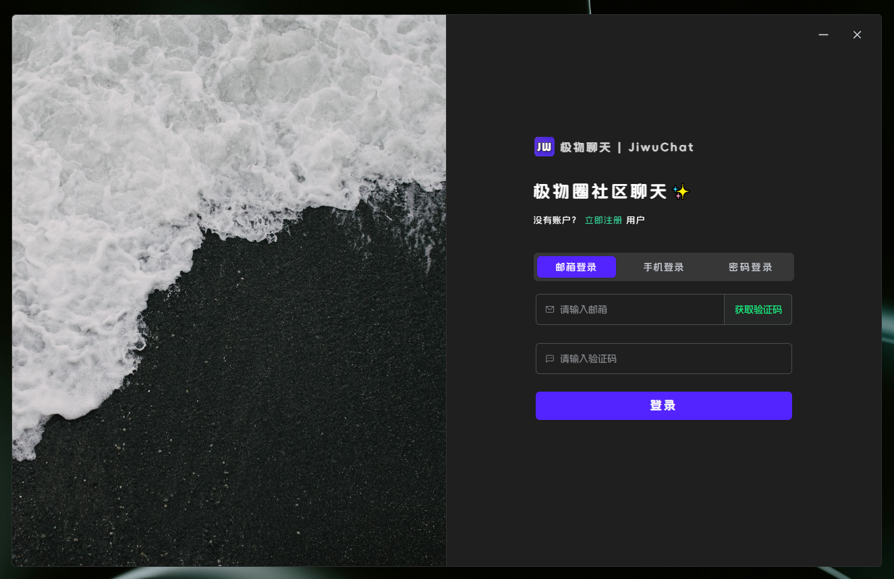
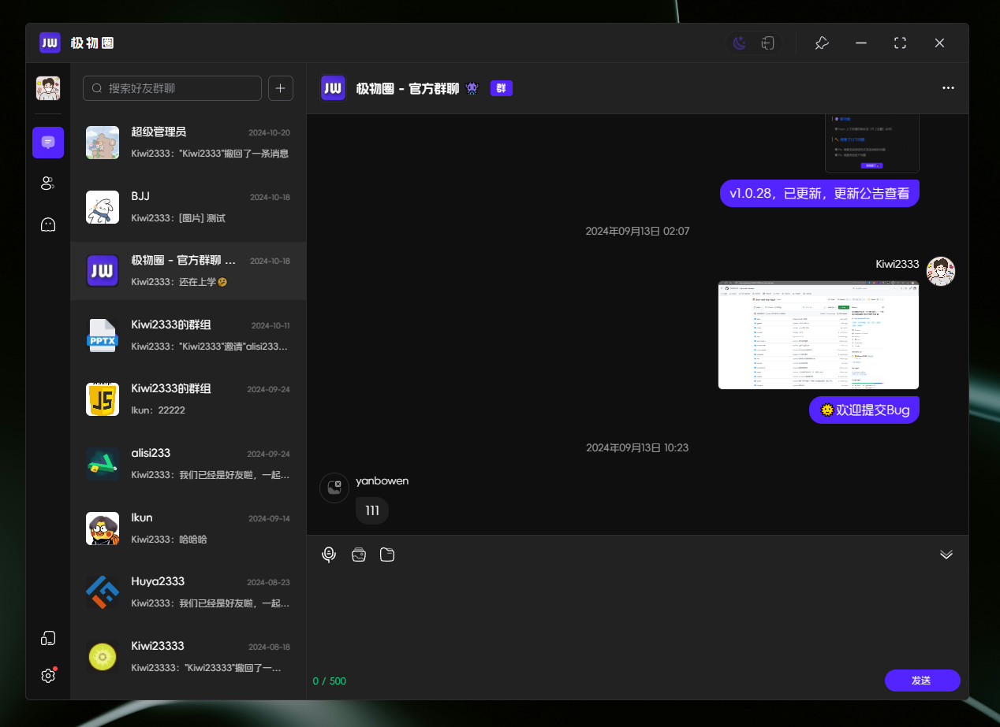
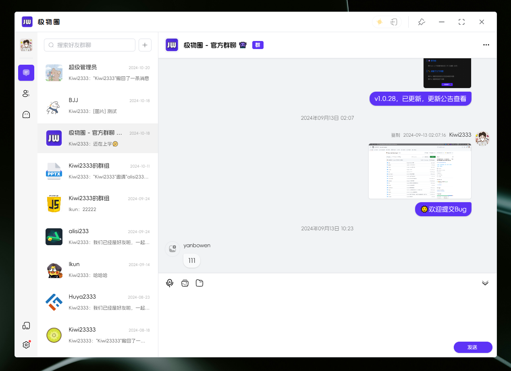
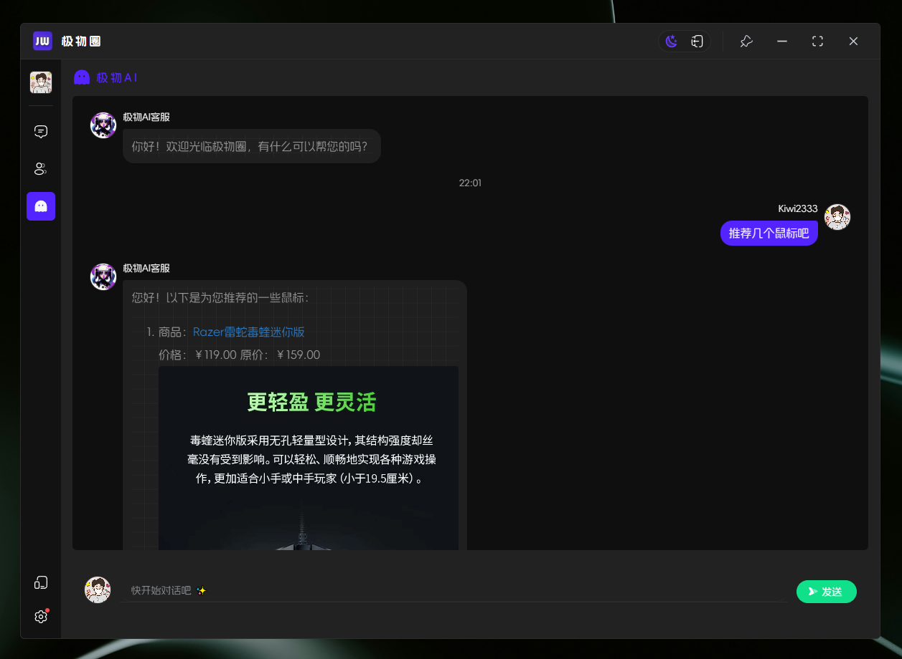
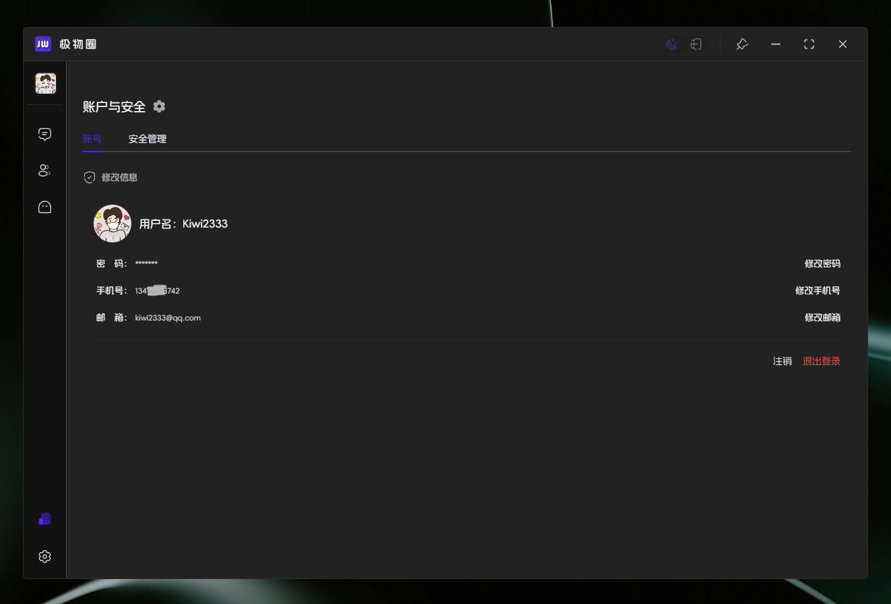
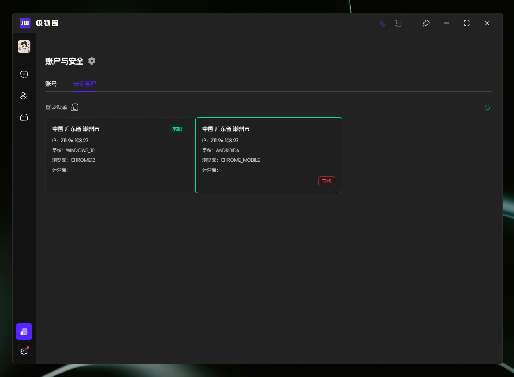
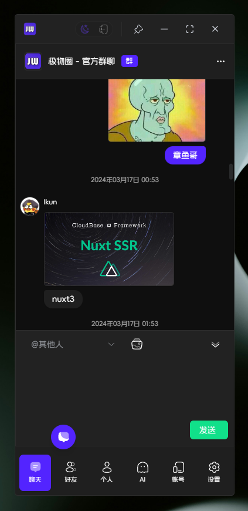
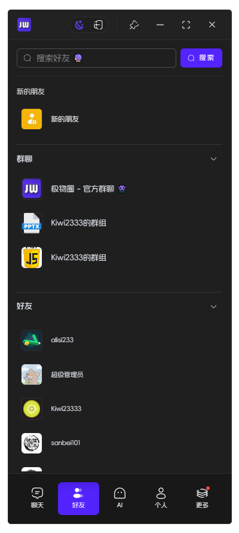

<div align=center>
 <h1 align=center margin="10em" style="margin:4em 0 0 0;font-size: 30px;letter-spacing:0.3em;">

 </h1>
 <h2 align=center style="font-size: 22px;">Jiwu Chat Tauri APP</h2>

<div>
      <a href="https://github.com/Kiwi233333/jiwu-mall-chat-tauri" target="_blank">
        
      </a>
      <a href="https://github.com/Kiwi233333/jiwu-mall-chat-tauri/stargazers" target="_blank">
        
      </a>
    </div>
    <div >
      <a href="https://github.com/Kiwi233333/jiwu-mall-chat-tauri/commits" target="_blank">
        
      </a>
      <a href="https://github.com/Kiwi233333/jiwu-mall-chat-tauri/issues" target="_blank">
        
      </a>
      <a href="https://github.com/Kiwi233333/jiwu-mall-chat-tauri/blob/master/LICENSE" target="_blank">
        
      </a>
    </div>

Language : English | [简体中文](./README.md)

</div>

### Introduction

Jiwu Chat Tauri APP is a chat desktop application based on the Nuxt3 + Tauri + element-plus basic framework. It provides a beautiful user interface and integrates chat and social functions. At the same time, it supports AI shopping chat and global dark mode. Users can use the app for real-time chat, share dynamic and AI customer service questions and answers.

### Technology

```txt
Based on Nuxt3 + Tauri + element-plus basic framework
```

### Project Screenshots

- Chat Desktop Application Login



- Chat Desktop Application Chat



- Global Dark Mode Light / Dark



- Chat Social


- AI Shopping Chat



- Account and Security





- Responsive



## ⏳ Project Setup

```sh
# node version >= 16
npm install -g pnpm

pnpm install
```

### ✨ Development

```sh
# It is recommended to run separately
# 1) Start nuxt
pnpm run dev:nuxt 
# 2) Start tauri
pnpm run dev:tauri 
```

### 📦 Packaging

```sh
pnpm run build
```

or

```sh
# First build nuxt, then build tauri
pnpm run build:nuxt

pnpm run build:tauri
```

### ❌ pnpm install error

View source

```sh
pnpm get registry 
```

Temporary modification

```sh
pnpm --registry https://registry.npm.taobao.org install any-touch
```

Persistent use

```sh
pnpm config set registry https://registry.npm.taobao.org
```

Restore

```sh
pnpm config set registry https://registry.npmjs.org
```

### 🔧 Tech Stack

| Category         | Technology/Component   | Version Number   |
| --------------------- | ---------------------- | ---------------- |
| Framework        | Nuxt3                 | 3.12.2          |
|                 | Tauri                 | 1.5.6            |
| UI Component | Element Plus         | 2.7.6           |
| State Management  | Pinia                 | 2.1.7           |
| Toolkit         | Vueuse                | 10.11.0         |
| Build and Development Tools | Nuxi               | lts            |
|                 | Vite                  | lts             |
| Code Quality     | ESLint                | 8.56.0          |
|                 | Prettier               | 3.3.2           |
| Type Checking    | TypeScript            | 5.3.2           |
| Style Handling   | Sass                  | 1.77.6          |
