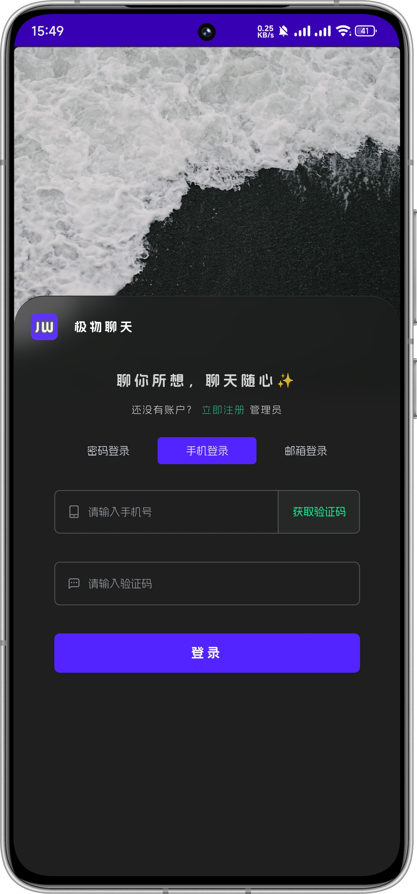
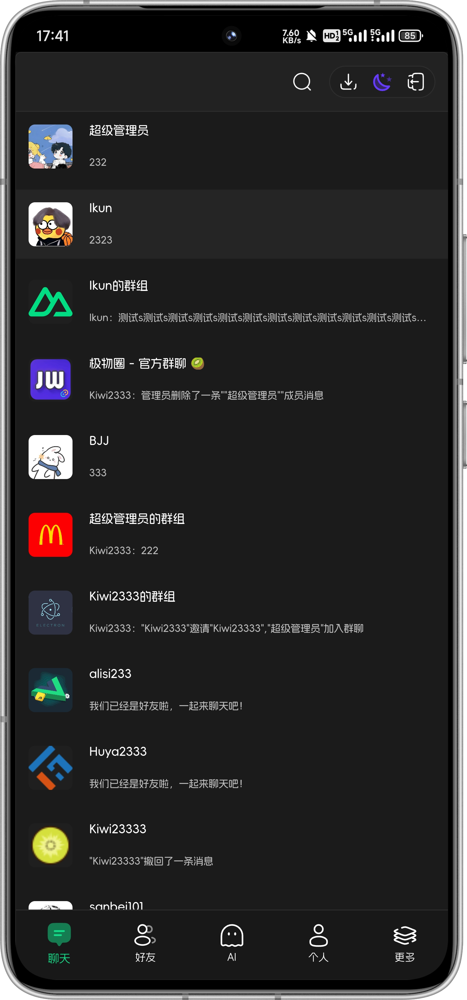
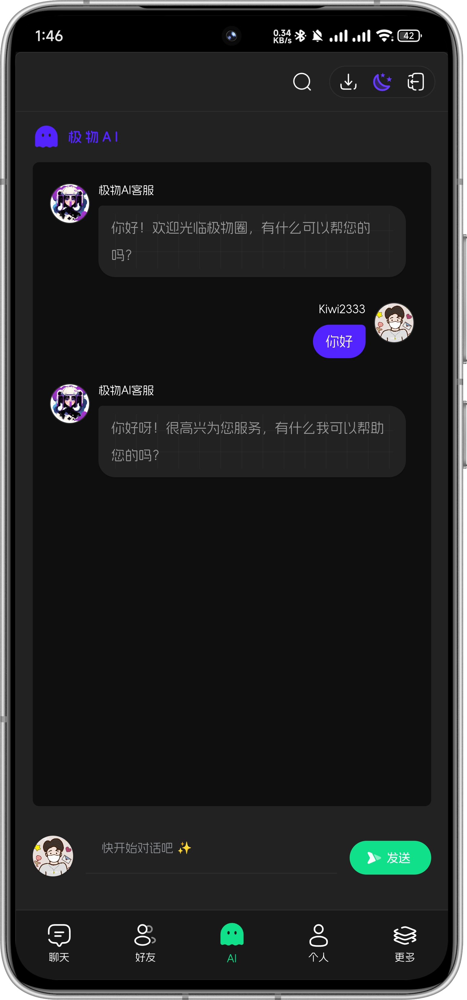
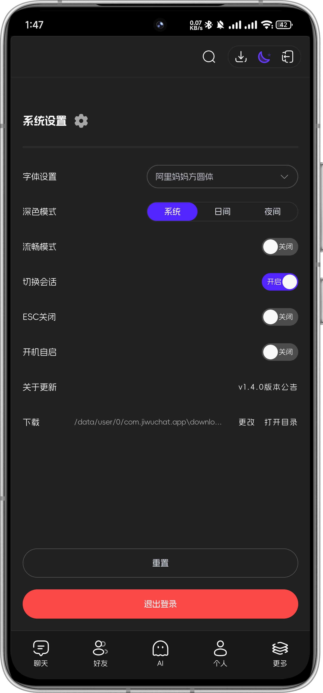
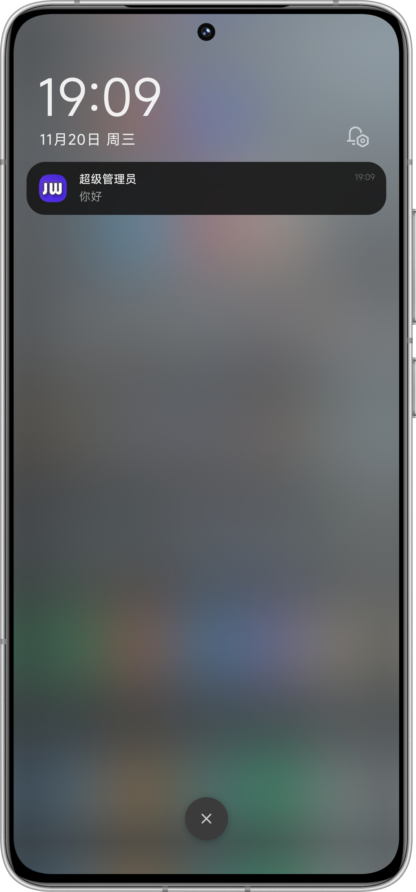

<div align=center>
 <div align=center margin="10em" style="margin:4em 0 0 0;font-size: 30px;letter-spacing:0.3em;">

 </div>
 <h2 align=center style="margin: 2em 0;">JiwuChat Tauri APP</h2>

<div>
      <a href="https://github.com/Kiwi233333/jiwu-mall-chat-tauri" target="_blank">
        
      </a>
      <a href="https://github.com/Kiwi233333/jiwu-mall-chat-tauri/stargazers" target="_blank">
        
      </a>
    </div>
    <div >
      <a href="https://github.com/Kiwi233333/jiwu-mall-chat-tauri/commits" target="_blank">
        
      </a>
      <a href="https://github.com/Kiwi233333/jiwu-mall-chat-tauri/issues" target="_blank">
        
      </a>
      <a href="https://github.com/Kiwi233333/jiwu-mall-chat-tauri/blob/master/LICENSE" target="_blank">
        
      </a>
    </div>

Language: English | [Simplified Chinese](./README.md)
</div>

## Introduction

JiwuChat Tauri APP is a chat desktop application based on the Nuxt3 + Tauri + element-plus framework. It provides an aesthetically pleasing user interface and integrates chat and social features. It also supports AI shopping chat and global dark mode. Users can engage in real-time chat, share updates, and AI customer service Q&A through the app.

## Multi-platform Support


## Default Account

- Account: ikun233
- Password: 123456

Note: This account does not have permissions for uploading images, changing passwords, etc.

## Feature List

| Feature Module | Description | Status |
| --- | --- | --- |
| User Module | Supports login and registration with account, phone number, and email | ✔ |
| Message Module | Supports real-time chat with text, images, files, voice, @users, retract, delete, and other message types | ✔ |
| Conversation Module | Supports group chat, private chat, and various roles such as group owner, administrator, and ordinary user | ✔ |
| Contact Module | Supports viewing, adding, and deleting contacts | ✔ |
| System Version Module | Supports automatic app updates and viewing version announcements | ✔ |
| Account & Security Module | Provides functions for account login, password change, account management, device security, and account online/offline | ✔ |
| AI Shopping Module | AI shopping chat feature, providing product recommendations under "Jiwu Circle" | ✔ |
| File Download Management Module | Supports local file download, open, and delete functions | ✔ |
| Other Features | Global dark mode, font, custom download path, multi-system support, customized settings, etc. | ✔ |

## Project Screenshots

- Chat Desktop App Login


- Chat Desktop App Chat


- Global Dark Mode Light / Dark


- Chat Social


- AI Shopping Chat


- Account & Security


- Mobile Adaptation

<div>
 
 
 
 
 
 
 
</div>

## ⏳ Getting Started

### 📦 Install Dependencies

```sh
# Node version >= 16
npm install -g pnpm

pnpm install
```

### ✨ Development

- If there is a backend service, you can modify the `.env.development` environment variable file for development

```sh
# It is recommended to run separately
# Terminal 1: Start nuxt
pnpm run dev:nuxt
# Terminal 2: Start tauri
pnpm run dev:tauri
```

- If there is no backend service, modify the `.env.development` environment variable or use the `.env.production` configuration file.

```sh
# Terminal 1: Start prod nuxt (recommended ✔)
pnpm run nuxt:prod
# Terminal 2: Start tauri
pnpm run dev:tauri
```

### 📦 Package

```sh
pnpm run build:tauri
```

### ❌ pnpm install error

Check the source

```sh
pnpm get registry
```

Temporary modification

```sh
pnpm --registry https://registry.npm.taobao.org install any-touch
```

Permanent use

```sh
pnpm config set registry https://registry.npm.taobao.org
```

Restore

```sh
pnpm config set registry https://registry.npmjs.org
```

## 🔧 Technology Stack | Tech Stack

| Category        | Technology/Component | Version   |
| --------------- | ------------------- | --------- |
| Framework      | Nuxt3              | ^3.14.159+ |
|                 | Tauri              | ^2.1.0    |
| UI Component Library | Element Plus      | ^2.8.4    |
| State Management | Pinia             | 2.1.7     |
| Utility Library | Vueuse            | 10.11.0   |
| Build & Development Tools | Nuxi          | lts      |
|                 | Vite              | lts      |
| Code Quality   | ESLint            | 8.56.0    |
|                 | Prettier          | 3.3.2    |
| Type Checking  | TypeScript        | 5.3.2    |
| Style Processing | Sass             | 1.77.6   |

## 💬 Contact

- Email: [kiwi2333@qq.com](mailto:kiwi2333@qq.com)
- QQ: [1329634286](https://wpa.qq.com/msgrd?v=3&uin=1329634286&site=qq&menu=yes)

## Trends


