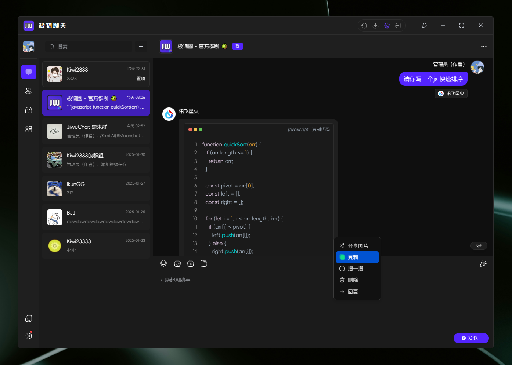

<div align=center>
 <div align=center margin="10em" style="margin:4em 0 0 0;font-size: 30px;letter-spacing:0.3em;">

 </div>
 <h2 align=center style="margin: 2em 0;">JiwuChat Tauri APP</h2>

<div>
      <a href="https://github.com/Kiwi233333/jiwu-mall-chat-tauri" target="_blank">
        
      </a>
      <a href="https://github.com/Kiwi233333/jiwu-mall-chat-tauri/stargazers" target="_blank">
        
      </a>
    </div>
    <div>
      <a href="https://github.com/Kiwi233333/jiwu-mall-chat-tauri/commits" target="_blank">
        
      </a>
      <a href="https://github.com/Kiwi233333/jiwu-mall-chat-tauri/issues" target="_blank">
        
      </a>
    </div>
    <div>
      <a href="`https://github.com/Kiwi233333/jiwu-mall-chat-tauri/blob/main/LICENSE`" target="_blank">
          
      </a>
      <a href="https://app.netlify.com/sites/jiwuchat/deploys" target="_blank">
          
      </a>
      <a href="https://qm.qq.com/q/iSaETNVdKw" target="_blank">
        
      </a>
    </div>

Language: [简体中文](./README.md) | English

</div>

## Introduction

JiwuChat is a lightweight `(~10MB)` cross-platform chat application built with Tauri2 and Nuxt3, featuring real-time messaging, AI chatbots (integrated with `iFlyTek Spark`, `KimiAI`, etc.), `WebRTC audio/video calls`, screen sharing, and AI-powered shopping capabilities. It supports seamless cross-device communication with text, images, files, voice messages, group chats, and customizable settings. Offers light/dark themes to enhance social networking efficiency.✨

## One Codebase, Multi-Platform Support


## Default Account
- Username: ikun233
- Password: 123456
- Experience: [Web Version](https://chat.jiwu.kiwi233.top/)

> ⚠ Note: This account is only used as a test account because it does not have permission to upload files, modify personal information, and modify passwords

## Features

| Module          | Description                                                                 | Status |
|-----------------|-----------------------------------------------------------------------------|--------|
| User Module     | Login/Register via username, phone, or email                               | ✔      |
| Messaging       | Real-time text, images, files, voice, @mentions, recall, delete            | ✔      |
| Conversations   | Group chats, private chats with roles (owner/admin/user)                   | ✔      |
| Contacts        | View/add/remove contacts                                                   | ✔      |
| Version Updates | Auto-updates and version release notes                                     | ✔      |
| Account Security| Password change, device management, login history                          | ✔      |
| AI Module             | Supports multiple AI Chatbots chatbots like `iFlyTek Spark`, `KimiAI`, etc.         | ✔      |
| Intelligent Customer Service | `AI`-powered shopping chat providing product recommendations from `JiwuMall` | ✔      |
| File Management | Local file download/open/delete                                            | ✔      |
| Voice/Video     | WebRTC-based screen sharing, voice/video calls                             | ✔      |
| Others          | Dark mode, font customization, multi-OS support                            | ✔      |

## Screenshots

- Desktop App Login / Register


- Light / Dark Themes


- AI Chatbots




- WebRTC Voice/Video Chat


- Screen Sharing


- Social Chat


- AI Shopping (Powered by [Jiwu Circle](https://github.com/KiWi233333/jiwu-mall-sites))


- Account & Security


- Mobile Adaptation

<div>
 
 
 
 
 
 
 
 
 
</div>

## ⏳ Getting Started

### 📦 Install Dependencies

```sh
# Requires Node.js >= 18
npm install -g pnpm

pnpm install
```

### ✨ Development

- 📌 If you **don't have** a backend service, modify `.env.development` or use `.env.production`.

```sh
# Terminal 1: Start Nuxt (Production)
pnpm run prod:nuxt
# Terminal 2: Start Tauri
pnpm run dev:tauri
```

- If you **have** a backend service, customize `.env.development` for development.

```sh
# Recommended to run separately
# Terminal 1: Start Nuxt
pnpm run dev:nuxt
# Terminal 2: Start Tauri
pnpm run dev:tauri
```

### 📦 Build

```sh
pnpm run build:tauri
```

### ❌ pnpm Install Errors

Check registry:
```sh
pnpm get registry
```

Temporary fix:
```sh
pnpm --registry https://registry.npm.taobao.org install any-touch
```

Persistent change:
```sh
pnpm config set registry https://registry.npm.taobao.org
```

Restore default:
```sh
pnpm config set registry https://registry.npmjs.org
```

## 🔧 Tech Stack

| Category       | Technology           | Version       |
|----------------|----------------------|---------------|
| Framework      | Nuxt                | ^3.14.159+    |
|                | Tauri               | ^2.1.0        |
| UI Library     | Element Plus        | ^2.8.4        |
| State Management| Pinia               | 2.1.7         |
| Utility        | Vueuse              | 10.11.0       |
| Build Tools    | Nuxi                | lts           |
|                | Vite                | lts           |
| Code Quality   | ESLint              | 8.56.0        |
|                | Prettier            | 3.3.2         |
| Type Checking  | TypeScript          | 5.3.2         |
| Styling        | Sass                | 1.77.6        |

## 🦾 Star History


## 💬 Contact

- Email: [kiwi2333@qq.com](mailto:kiwi2333@qq.com)
- QQ: [1329634286](https://wpa.qq.com/msgrd?v=3&uin=1329634286&site=qqq&menu=yes)
- QQ Group: [939204073](https://qm.qq.com/q/iSaETNVdKw)
