<div align=center>
 <div align=center margin="10em" style="margin:4em 0 0 0;font-size: 30px;letter-spacing:0.3em;">

 </div>
 <h2 align=center style="margin: 2em 0;">JiwuChat Tauri APP</h2>

<div>
      <a href="https://github.com/Kiwi233333/jiwu-mall-chat-tauri" target="_blank">
        
      </a>
      <a href="https://github.com/Kiwi233333/jiwu-mall-chat-tauri/stargazers" target="_blank">
        
      </a>
    </div>
    <div>
      <a href="https://github.com/Kiwi233333/jiwu-mall-chat-tauri/commits" target="_blank">
        
      </a>
      <a href="https://github.com/Kiwi233333/jiwu-mall-chat-tauri/issues" target="_blank">
        
      </a>
    </div>
    <div>
      <a href="`https://github.com/Kiwi233333/jiwu-mall-chat-tauri/blob/main/LICENSE`" target="_blank">
          
      </a>
      <a href="https://app.netlify.com/sites/jiwuchat/deploys" target="_blank">
          
      </a>
    </div>

Language : [简体中文](./README.en.md) | English

</div>

## Introduction

JiwuChat is a lightweight `(~10MB)` multi-platform chat application built with Tauri2 and Nuxt3. It features real-time messaging, AI group chat bots (`iFlytek Spark`, `KimiAI`, etc.), `WebRTC audio/video calls`, screen sharing, and AI shopping capabilities. It supports seamless cross-device communication, covering text, images, files, and voice messages, as well as group chats and customizable settings. It offers light/dark modes to enhance efficient social networking. ✨

## One Codebase, Multiple Platforms


## Default Account
- Username: ikun233
- Password: 123456
- Experience: [Web Version](https://chat.jiwu.kiwi233.top/)

> ⚠ Note: This account does not have permissions to upload files, modify personal information, change passwords, etc. It is only for testing purposes.

## Feature List

| Module | Description | Status |
| --- | --- | --- |
| User Module | Supports login and registration via username, phone number, and email | ✔ |
| Message Module | Supports real-time chat with text, images, files, voice, @mentions, message recall, and deletion | ✔ |
| Conversation Module | Supports group chats, private chats, and roles like group owner, admin, and regular user | ✔ |
| Contacts Module | Supports viewing, adding, and deleting contacts | ✔ |
| System Version Module | Supports automatic app updates, version announcements, etc. | ✔ |
| Account & Security Module | Provides account login, password change, account management, device security, and online/offline status | ✔ |
| AI Module | Supports multiple AI chat bots in group chats, such as `iFlytek Spark` and `KimiAI` | ✔ |
| Smart Customer Service Module | AI shopping chat functionality, providing product recommendations from `JiwuMall` | ✔ |
| File Download Management Module | Supports local file download, opening, and deletion | ✔ |
| Audio/Video Module | WebRTC-based screen sharing, voice, and video chat | ✔ |
| Other Features | Global dark mode, fonts, custom download paths, multi-system support, and customizable settings | ✔ |

## Project Screenshots

- Chat Desktop App Login / Register


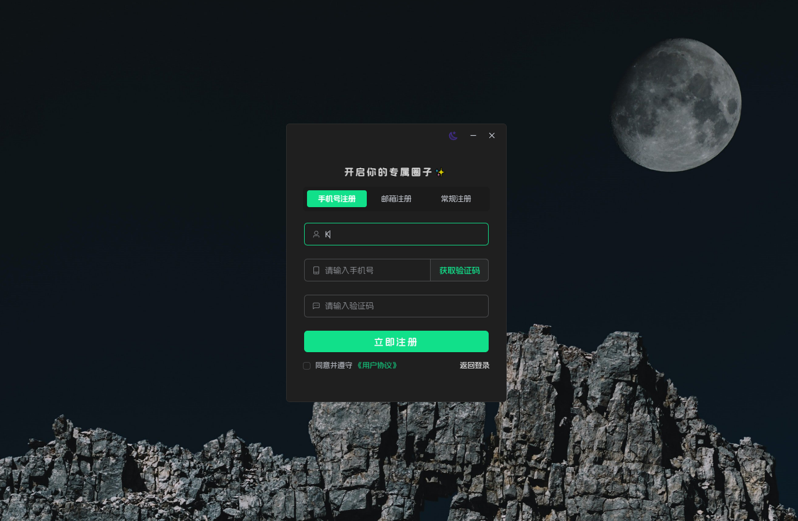

- Light / Dark Themes


- AI Chatbot (DeepSeek, iFlytek Spark, Kimi AI) 🤩

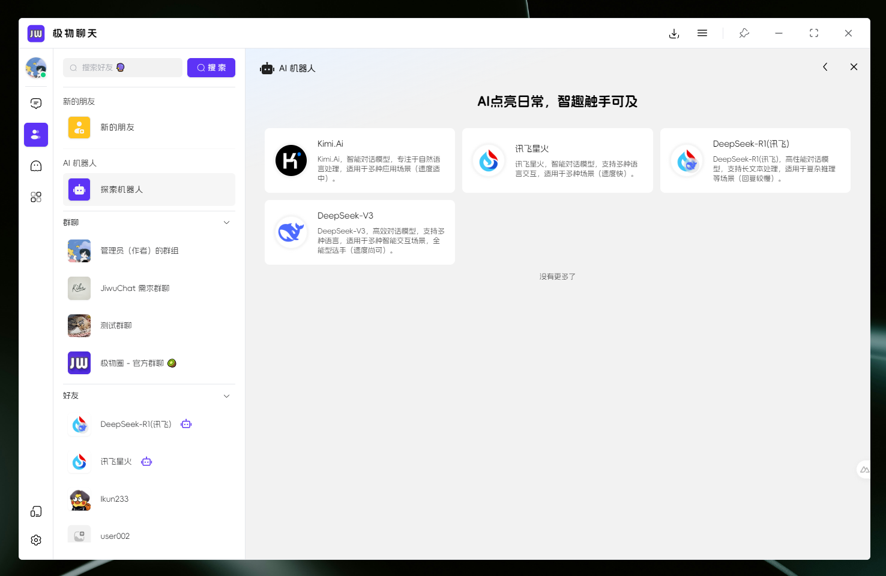

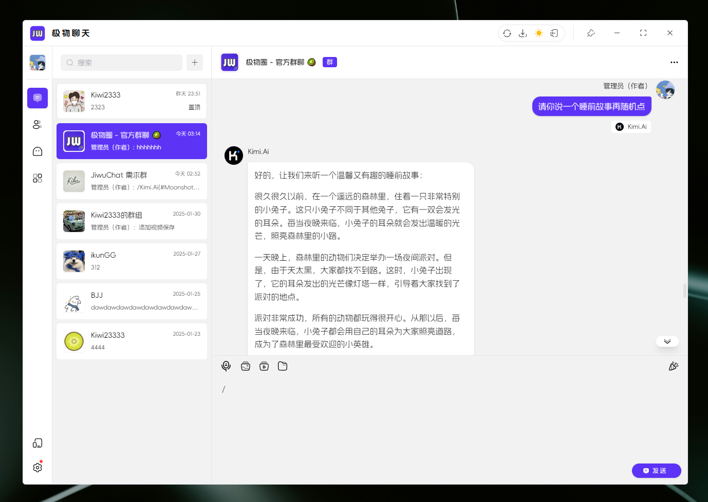

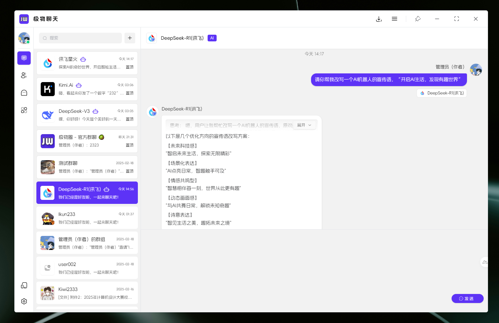


- Audio/Video Chat (WebRTC)

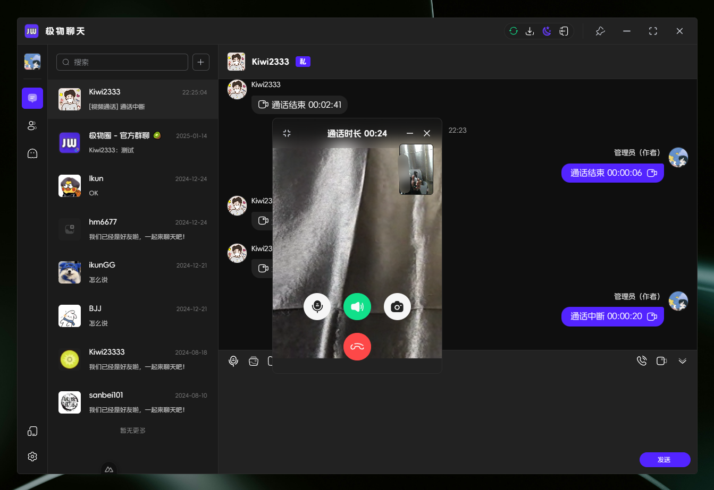

- Screen Sharing

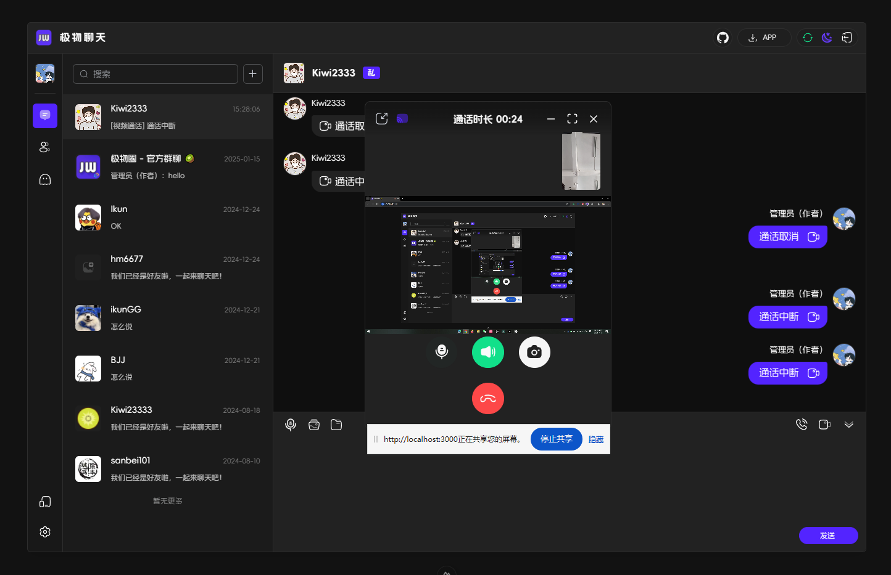

- Chat Social


- AI Shopping Chat (Source: [JiwuMall](https://github.com/KiWi233333/jiwu-mall-sites))


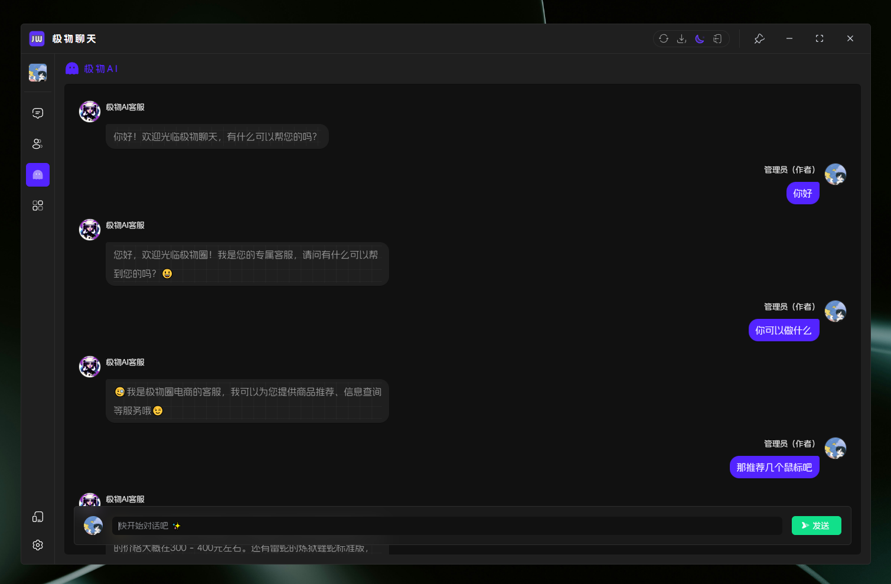

- Account & Security


- Mobile Adaptation

<div>
 
 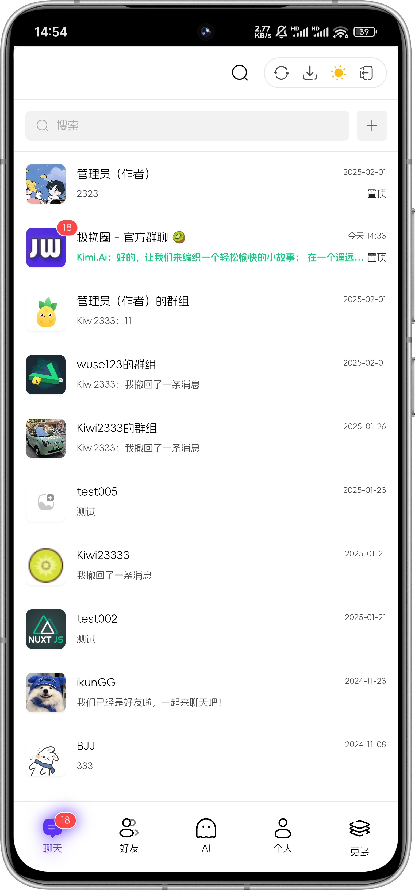
 
 
 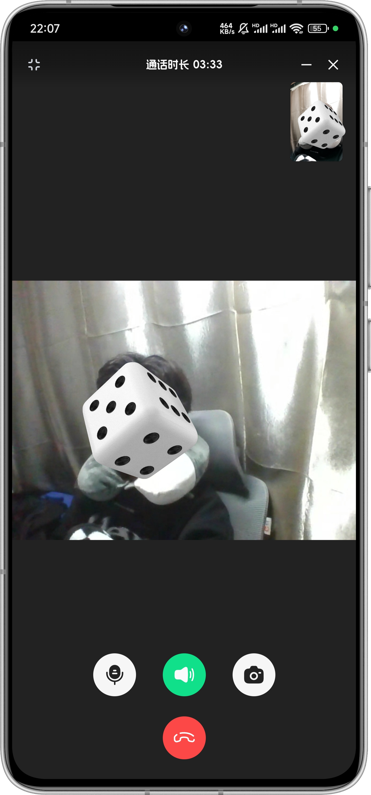
 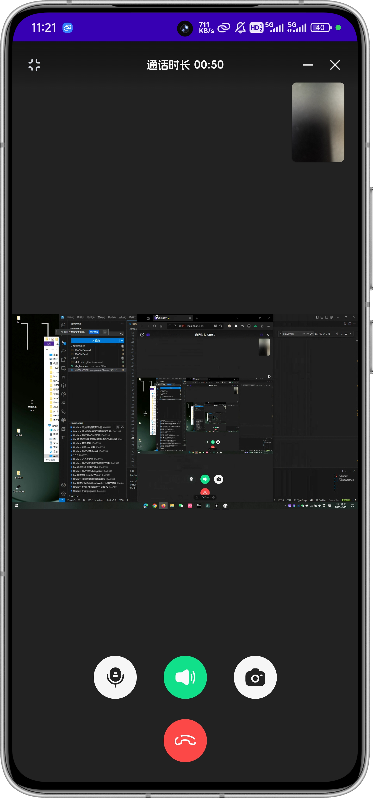
 
 
 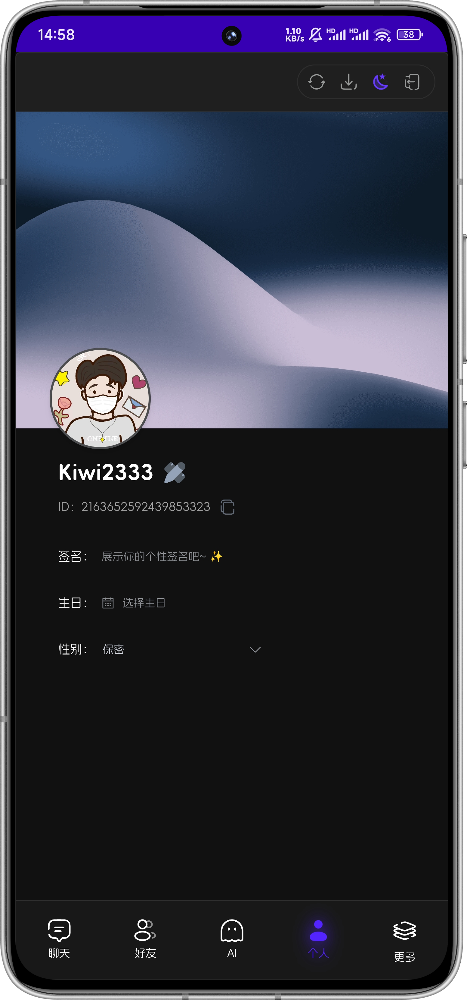
 
 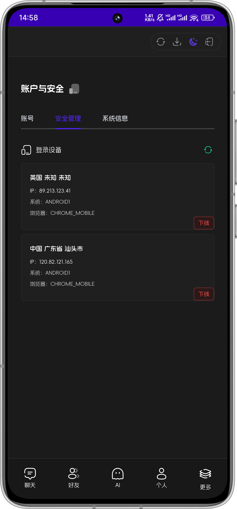
 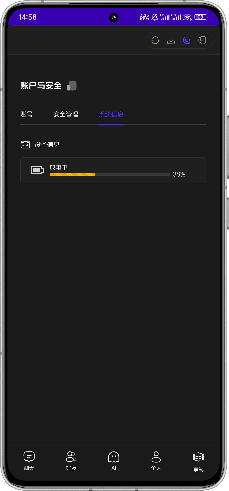
 
</div>

## ⏳ Getting Started

### 📦 Install Dependencies

```sh
# node version >= 18
npm install -g pnpm

pnpm install
```

### ✨ Development

- 📌 If you do `not` have a backend service, modify the `.env.development` environment variables or use the `.env.production` configuration file.

```sh
# Terminal 1: Start Nuxt (Production Environment)
pnpm run prod:nuxt
# Terminal 2: Start Tauri
pnpm run dev:tauri
```

- If you `have` a backend service, you can modify the `.env.development` environment variables for development.

```sh
# Recommended to run separately
# Terminal 1: Start Nuxt
pnpm run dev:nuxt
# Terminal 2: Start Tauri
pnpm run dev:tauri
```

### 📦 Build

```sh
pnpm run build:tauri
```

### ❌ pnpm install error

Check the registry

```sh
pnpm get registry
```

Temporary change

```sh
pnpm --registry https://registry.npm.taobao.org install any-touch
```

Persistent change

```sh
pnpm config set registry https://registry.npm.taobao.org
```

Revert

```sh
pnpm config set registry https://registry.npmjs.org
```

## 🔧 Tech Stack | Tech Stack

| Category         | Technology/Component          | Version       |
| ------------- | ------------------ | ------------ |
| Framework         | Nuxt             | ^3.14.159+       |
|                 | Tauri               | ^2.1.0        |
| UI Library     | Element Plus       | ^2.8.4        |
| State Management     | Pinia              | 2.1.7        |
| Utility Library       | Vueuse             | 10.11.0      |
| Build & Development Tools | Nuxi               | lts        |
|              | Vite               | lts         |
| Code Quality     | ESLint             | 8.56.0       |
|              | Prettier           | 3.3.2        |
| Type Checking     | TypeScript         | 5.3.2        |
| Styling     | Sass               | 1.77.6       |

## 🦾  Trends


## 💬 Contact

- Email: [kiwi2333@qq.com](mailto:kiwi2333@qq.com)
