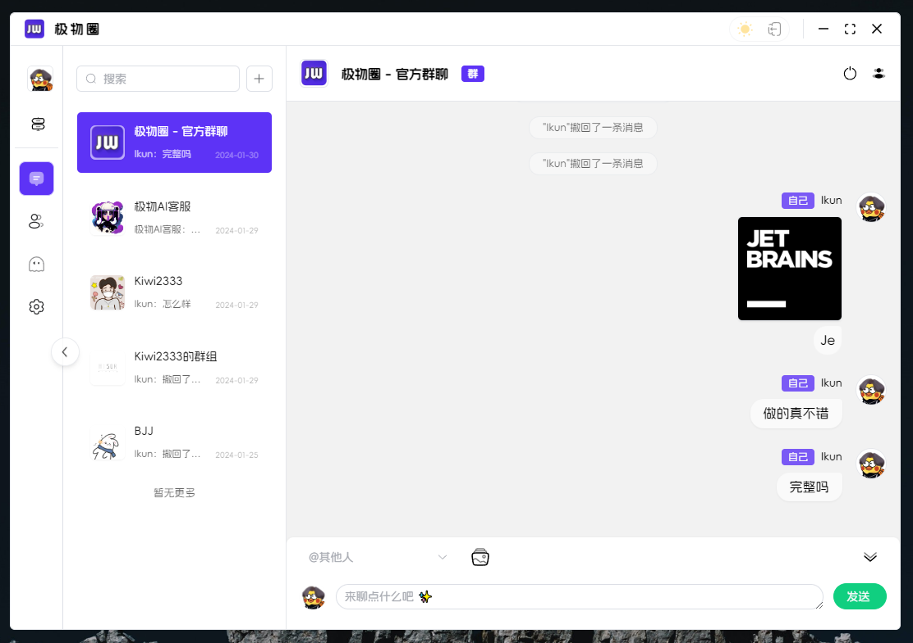
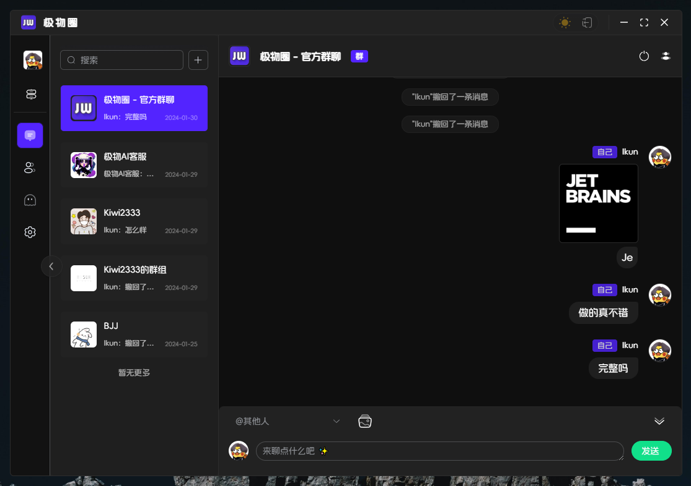
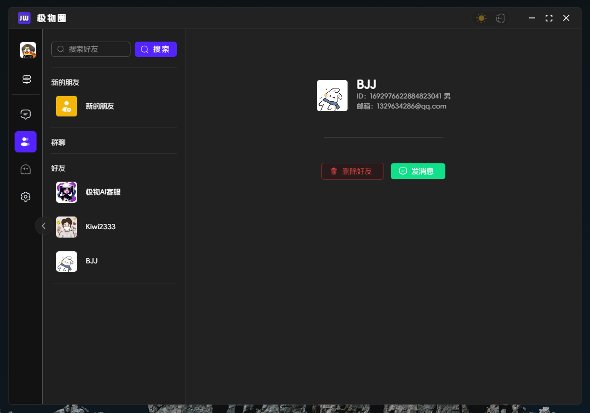
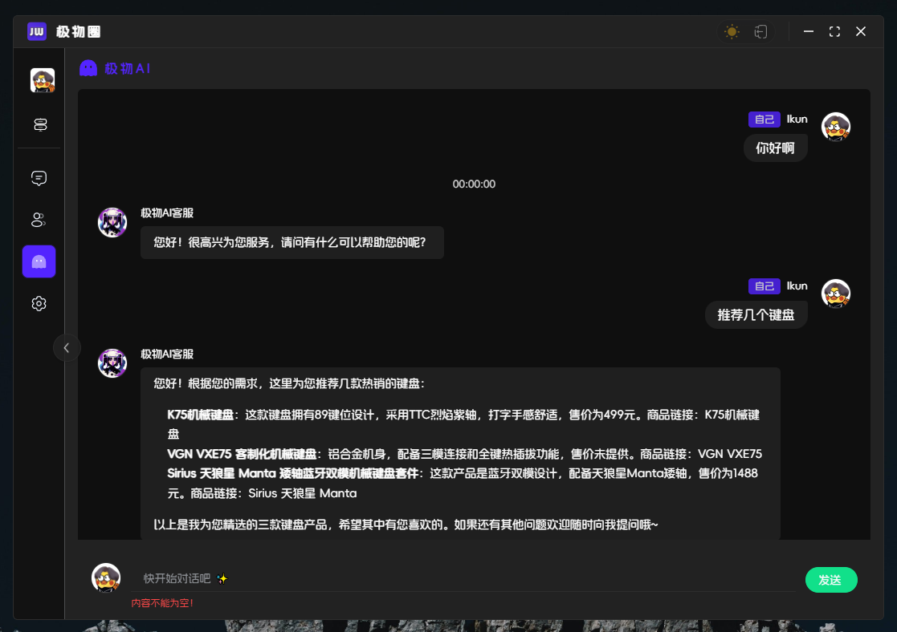
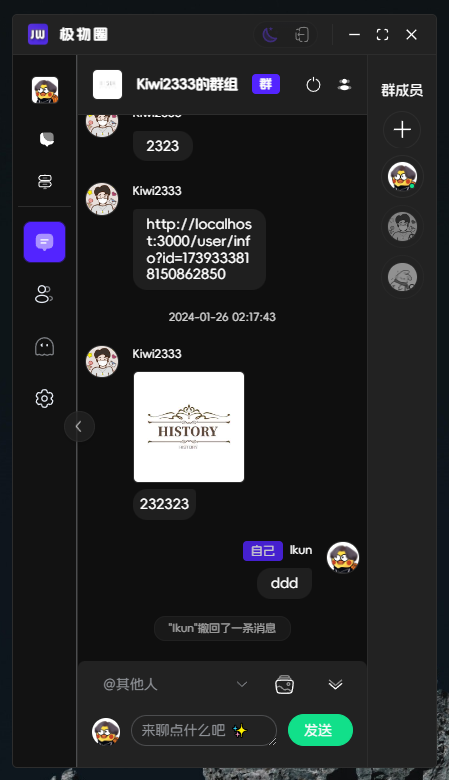

<h1 align=center margin="10em" style="margin:4em 0 0 0;font-size: 30px;letter-spacing:0.3em;">

&

 </h1>
 <h2 align=center style="font-size: 22px;">极物聊天 Tauri APP</h2>

### 介绍

极物圈是一个综合性平台，集商城和社交功能于一体。在这个平台上，用户可以轻松购买虚拟商品，并且可以发布个人帖子，与他人互动，进行评论等。该平台注重用户体验，为用户提供了一个在你圈子交流、好物推荐、分享和购物的多功能环境。

### 技术

```txt
基于Nuxt3 + Tauri + element-plus 基本框架
```

### 项目截图

- 聊天桌面应用 Chat



- 全局夜间模式 Light / Dark



- 聊天社交



- AI购物聊天



- 响应式



## ⏳ 起步 | Project Setup

```sh
# node 版本 >= 16
npm install -g pnpm

pnpm install
```

### ✨ 开发

```sh
# 建议分开运行
# 1）启动nuxt
pnpm run dev:nuxt 
# 2）启动tauri
pnpm run dev:tauri 
```

### 📦 打包

```sh
pnpm run build
```

### ❌ pnpm install error

查看源

```sh
pnpm get registry 
```

临时修改

```sh
pnpm --registry https://registry.npm.taobao.org install any-touch
```

持久使用

```sh
pnpm config set registry https://registry.npm.taobao.org
```

还原

```sh
pnpm config set registry https://registry.npmjs.org
```
